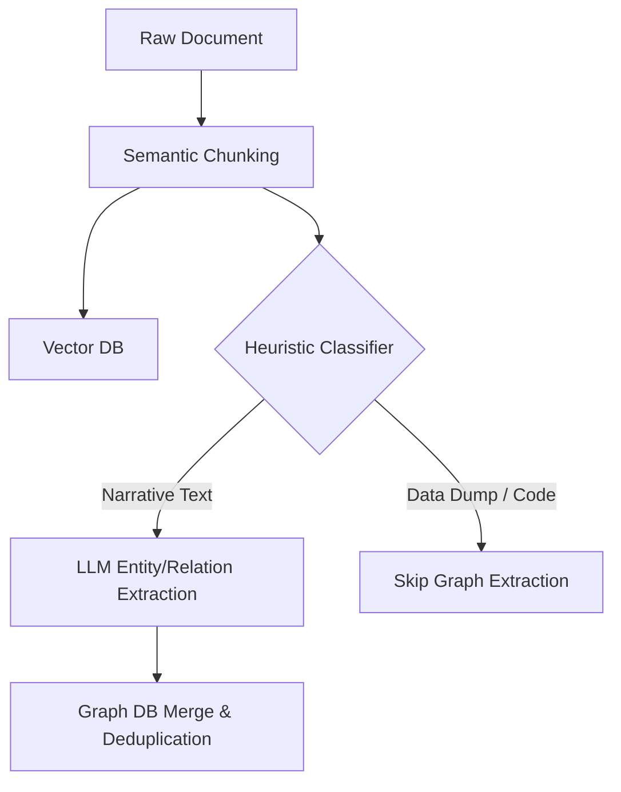
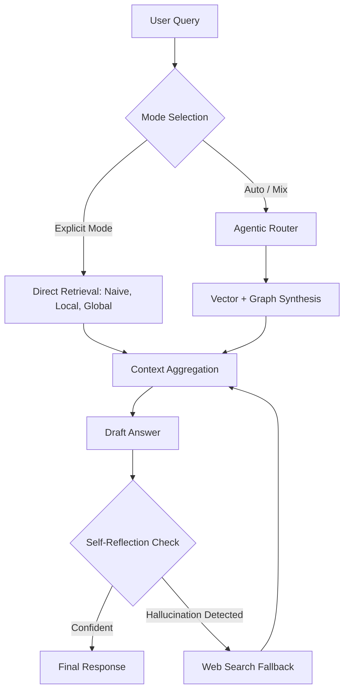

<div align="center">
  <h1>🚀 AdeptRAG</h1>
  <p><b>Intelligent Hybrid Graph & Vector Retrieval-Augmented Generation</b></p>

  <p>
    <a href="https://github.com/1357koushik/AdeptRAG/stargazers"></a>
    <a href="https://github.com/1357koushik/AdeptRAG/network/members"></a>
    <a href="https://github.com/1357koushik/AdeptRAG/issues"></a>
    <a href="https://github.com/1357koushik/AdeptRAG/blob/main/LICENSE"></a>
    <a href="https://www.python.org/"></a>
  </p>
</div>

**AdeptRAG** is a fast, lightweight, and scalable Retrieval-Augmented Generation (RAG) framework that combines the semantic search of Vector Databases with the reasoning power of Knowledge Graphs. 

It solves the two biggest problems in modern RAG: **Graph Bloat** and **Rigid Retrieval**. By intelligently filtering documents and providing an agentic router for queries, AdeptRAG gives you the deep reasoning of Microsoft's GraphRAG at a fraction of the cost and latency.

---

## ✨ Key Features

- 🧠 **Intelligent Chunk Filtering:** Automatically detects list-heavy or non-narrative data and routes it directly to the vector database, bypassing expensive LLM graph extraction.
- 🔀 **Agentic Query Routing:** An LLM-driven router autonomously analyzes user intents to direct queries to the Vector DB, Local Graph, or Global Summaries.
- 🎛️ **Explicit Query Modes:** Need absolute control? Bypass the router with explicit modes: `naive` (Vector), `local` (Graph Entities), `global` (Graph Themes), or `mix`.
- ⚡ **Extreme Efficiency:** Skip multi-hop reasoning for simple fact-retrieval. AdeptRAG reduces unnecessary LLM calls during both indexing and querying.
- 🔄 **Native Deduplication:** Consolidate fragmented knowledge with built-in fuzzy matching for cross-document coreference resolution.

## 🚀 Quick Start

### Installation

Requires Python 3.10+. We recommend using a virtual environment.

```bash
git clone https://github.com/1357koushik/AdeptRAG.git
cd AdeptRAG
pip install -r requirements.txt
```

### Configuration

Copy the example `.env` file and add your API keys:
```bash
cp .env.example .env
```
Ensure you set your preferred LLM provider (e.g., `OPENAI_API_KEY`, `GEMINI_API_KEY`, or `ANTHROPIC_API_KEY`).

### Interactive CLI

AdeptRAG comes with a powerful TUI (Text User Interface) for managing your knowledge base and running queries.

```bash
python main.py
```

Inside the CLI, you can use the following commands:
- `/mount ./my_documents` - Ingests documents and builds the Graph & Vector databases.
- `/query What is the main topic?` - Uses the Agentic Router to find the answer.
- `/query --mode local Who is the CEO?` - Forces the engine to use the local Knowledge Graph.
- `/unmount file.txt` - Safely removes a document and its associated graph entities.

## 🏗️ Architecture Workflow

AdeptRAG relies on a dual-pipeline architecture to balance cost and accuracy.

### 1. The Ingestion Pipeline
Raw documents are chunked and embedded into the Vector database. A fast classifier determines if the chunk is narrative or a data dump, skipping the expensive LLM graph extraction if the chunk is just raw data.



### 2. The Retrieval Pipeline
Queries are either routed manually via explicit modes or passed to the Agentic Router. The system retrieves the necessary context and performs a self-reflection check before returning the final answer to prevent hallucinations.




## 📄 License

Distributed under the MIT License. See `LICENSE` for more information.
